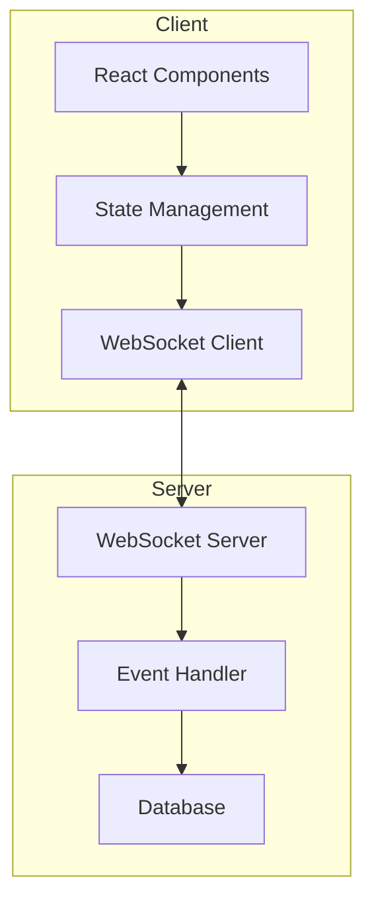
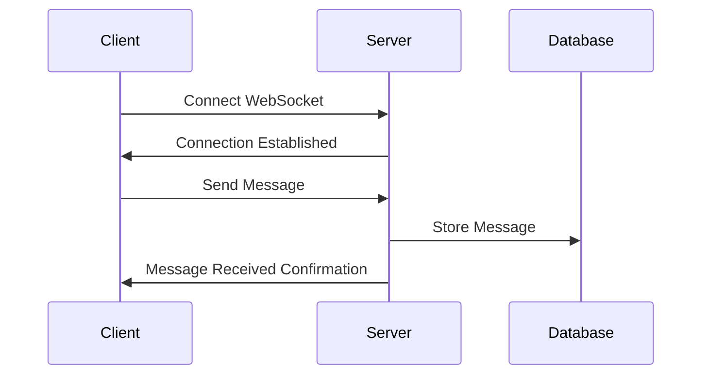

# Documentation Rules and Standards

This document defines the rules, standards, and guidelines for creating and maintaining documentation in the `docs` directory. All AI agents and human contributors must follow these standards to ensure consistency and quality across the documentation.

## Document Structure

### Directory Structure

Documentation must be organized in a hierarchical structure following this pattern:

```
docs/
├── README.md                      # Main entry point for documentation
├── DOCUMENTATION_RULES.md         # This rules file
├── [topic-area]/                  # Topic-specific directory (e.g., architecture, real-time)
│   ├── README.md                  # Overview of the topic area
│   ├── [specific-aspect-1].md     # Detailed document on a specific aspect
│   ├── [specific-aspect-2].md     # Detailed document on a specific aspect
│   └── [specific-aspect-3].md     # Detailed document on a specific aspect
└── [another-topic]/               # Another topic-specific directory
    └── ...
```

### Document Naming Conventions

- Use lowercase for all filenames
- Use hyphens (`-`) to separate words in filenames
- Use descriptive names that clearly indicate the content
- Main overview files should be named `README.md`
- Specific aspect files should be named according to their content (e.g., `socket-implementation.md`)

## Document Format

### Metadata Header

Every document must begin with a YAML metadata header enclosed in triple dashes (`---`):

```markdown
---
title: [Descriptive Title of the Document]
description: [Brief description of the document's content and purpose]
version: [Version number in format X.Y.Z]
last_updated: [Date in format DD/MM/YYYY]
author: [Author or team name]
status: [Draft/Review/Approved]
---
```

### Document Title

After the metadata header, include the document title as a level 1 heading:

```markdown
# [Document Title]
```

### Standard Sections

Each document should include the following sections in this order:

1. **Executive Summary** - Brief overview of the document's content and key points
2. **Overview/Introduction** - Introduction to the topic and its context
3. **Main Content Sections** - Detailed information organized in logical sections
4. **Conclusion** - Summary of key points and implications
5. **Next Steps** - Planned actions or recommendations
6. **References** - Related documents, external resources, etc.

Example structure:

```markdown
## Executive Summary

[Brief summary of the document's content and key points]

## Overview

[Introduction to the topic and its context]

## [Main Section 1]

[Detailed information about the first main aspect]

### [Subsection 1.1]

[Detailed information about a specific part of the first main aspect]

## [Main Section 2]

[Detailed information about the second main aspect]

## Conclusion

[Summary of key points and implications]

## Next Steps

[Planned actions or recommendations]

## References

[Related documents, external resources, etc.]
```

## Content Standards

### Text Formatting

- Use clear, concise language
- Write in the third person
- Use present tense
- Use active voice
- Break text into short paragraphs
- Use bullet points and numbered lists for clarity
- Use bold for emphasis
- Use italics for terms being defined

### Code Examples

Code examples must:

- Be enclosed in triple backticks with the appropriate language identifier
- Include syntax highlighting
- Be properly indented and formatted
- Include comments to explain complex parts
- Be complete and executable where possible

Example:

````markdown
```typescript
// Example of a WebSocket connection manager
export class ConnectionManager {
  private socket: WebSocket | null = null

  constructor(private url: string) {
    // Initialize the connection manager
  }

  // Connect to the WebSocket server
  async connect(): Promise<void> {
    this.socket = new WebSocket(this.url)
    // Setup event handlers
  }
}
```
````

### Diagrams

Diagrams must:

- Be created using Mermaid syntax
- Include a clear title
- Use consistent styling
- Be enclosed in triple backticks with the `mermaid` identifier

Example:

````markdown

````

### Tables

Tables must:

- Have clear headers
- Be properly aligned
- Use consistent formatting
- Include a caption or description before the table

Example:

```markdown
| Parameter | Type    | Description                        | Default |
| --------- | ------- | ---------------------------------- | ------- |
| url       | string  | WebSocket server URL               | -       |
| reconnect | boolean | Whether to automatically reconnect | true    |
| timeout   | number  | Connection timeout in milliseconds | 5000    |
```

## Cross-Referencing

### Internal Links

When referencing other documents within the documentation:

- Use relative paths
- Link to specific sections where appropriate
- Use descriptive link text

Example:

```markdown
For more information on WebSocket implementation, see [Socket Implementation](./socket-implementation.md#connection-management).
```

### External Links

When referencing external resources:

- Include the full URL
- Use descriptive link text
- Indicate if the link is to an external site

Example:

```markdown
For more information on WebSocket protocol, see [WebSocket API on MDN](https://developer.mozilla.org/en-US/docs/Web/API/WebSockets_API).
```

## Versioning and Maintenance

### Version Numbers

Version numbers follow the format X.Y.Z where:

- X is the major version (incremented for significant changes)
- Y is the minor version (incremented for feature additions)
- Z is the patch version (incremented for bug fixes and minor updates)

### Document Status

Documents must have one of the following status values:

- **Draft**: Initial creation or significant revisions
- **Review**: Ready for review by team members
- **Approved**: Reviewed and approved for publication

### Update Process

When updating a document:

1. Update the `version` in the metadata header
2. Update the `last_updated` date in the metadata header
3. Document changes in a changelog section if significant

## Language and Terminology

### Language

All documentation must be written in clear, professional English. Avoid:

- Jargon (unless defined)
- Colloquialisms
- Contractions
- Ambiguous pronouns

### Technical Terminology

- Define technical terms on first use
- Be consistent with terminology throughout the documentation
- Use industry-standard terms where possible

### Abbreviations and Acronyms

- Spell out abbreviations and acronyms on first use, followed by the abbreviation in parentheses
- Example: "WebSocket (WS) protocol"

## Specific Document Types

### README Files

README files serve as entry points and overviews. They must:

- Provide a clear overview of the topic or subtopic
- Include links to all related documents
- Be concise but comprehensive

### Implementation Documents

Implementation documents detail specific implementations. They must:

- Include code examples
- Explain design decisions
- Discuss trade-offs
- Include performance considerations

### Architecture Documents

Architecture documents describe system architecture. They must:

- Include high-level diagrams
- Explain component relationships
- Discuss design patterns
- Include scalability considerations

## Compliance

All documentation must comply with these rules. Non-compliant documentation should be updated to meet these standards as soon as possible.

## Examples

### Example Document Header

```markdown
---
title: WebSocket Implementation in Real-Time Chat
description: Detailed documentation of the WebSocket implementation for real-time communication in the chat system
version: 1.0.0
last_updated: 20/05/2025
author: Architecture Team
status: Draft
---

# WebSocket Implementation in Real-Time Chat

## Executive Summary

This document details the implementation of WebSockets for real-time communication in the chat system...
```

### Example Mermaid Diagram

````markdown

````

### Example Code Block

````markdown
```typescript
export class MessageHandler {
  constructor(private eventRouter: EventRouter) {}

  async handleMessage(userId: string, data: any): Promise<void> {
    // Validate message data
    this.validateMessage(data)

    // Process message
    const result = await this.processMessage(userId, data)

    // Notify clients
    this.notifyClients(result)
  }
}
```
````

## Conclusion

Following these documentation rules ensures consistency, clarity, and quality across all documentation. This makes the documentation more useful for all stakeholders and easier to maintain over time.
